# Clearing the R enviroment 
```{r}
rm(list=ls())
```
# Installing rplum
```{r eval=F}
install.packages('rplum')
```
# Loading the rplum library
```{r eval=F}
library(rplum)
```

# Running rplum 

In order to run the default example HP1C (This core extracted and measure by Dr. Nicole Sandersons). 
```{r eval=FALSE}
Plum()
```
Plum would ask if it should run the default 1 cm sections (giving in this case 30 sections) and it will show us a plot of the data.
```
The run's files will be put in this folder: 
~/Plum_runs/HP1C

 Run HP1C with 30 sections? (Y/n) 
```
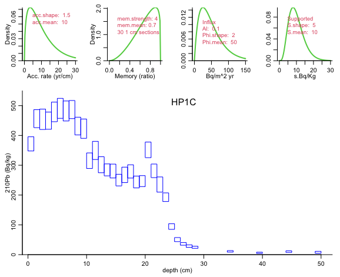{ width=50% }

After confirming, Plum will run and then plot the resulting chronology

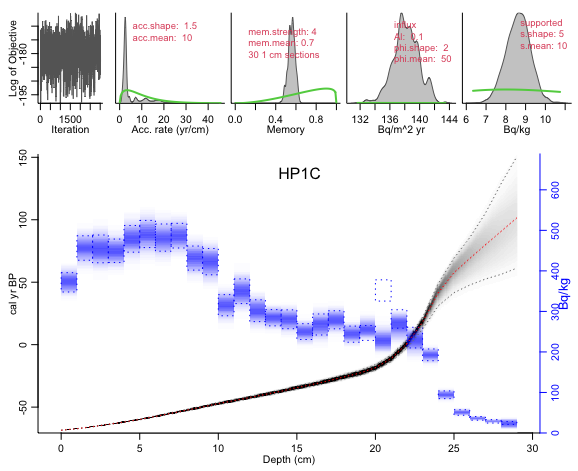{ width=50% }

Plum then will add a series of files into the folder. 

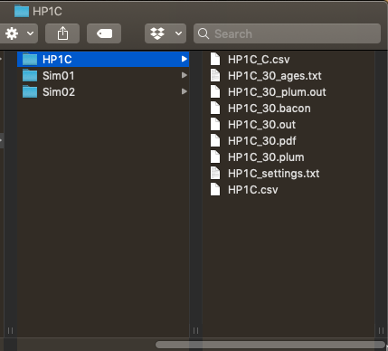{ width=50% }

- PDF file contain the resulting age-depth 
- *_ages.txt will contain the ages in a table with lower and upper credible intervals
- *_settings file will contained all the setting this Plum run used
- *.out and .bacon files are internal files and contain the same information we input in the command line

## Running my own cores

In order to run your own cores you should create a folder with the name of the core in the Plum_runs folder


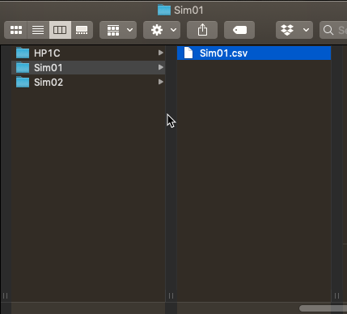{ width=50% }

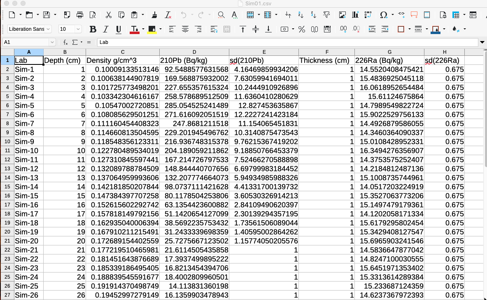{ width=50% }

Once this file is save within the folder of the same name you can run the command

```{r eval=FALSE}
Plum('Sim01')
```
 
Plum will as for extra information in order to run.

- First since we have data which can be used to estimate 
supported levels of $^{210}Pb$ it will ask of if we want to 
use a constant level of supported $^{210}Pb$ or allow each 
sample to have its own supported parameter at the same time it show us a plot of our data.
```
 Do you want to use the individual supported 210Pb? (y/n) 
```
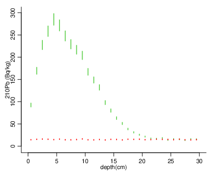{ width=50% }


In this examples, we will say no as this is simulated data. 

- It will now ask us for a coring date, this date is the 
surface date. We will provide 2020, which is equivalent 
of a coring date of january first 2020. 
```
Please provide a date (in AD) for the sample:
```

- Plum now will ask about how many sections to used
by default the length section is 1 cm.

```
Run Sim01 with 31 sections? (Y/n) 
```

Again Plum will show us the results.

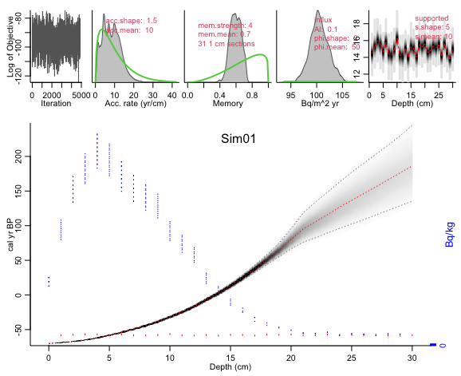{ width=50% }

# Adding extra information to our data file.

Plum allow us to add extra information to our data file.

By adding a extra column called info we can add:

- First cell: Coring date (surface date)

- Second cell: n.supp (number of samples to used explusively for estimating supported $^{210}Pb$)

- Third cell: Supported model (1: constant and 2: individual)

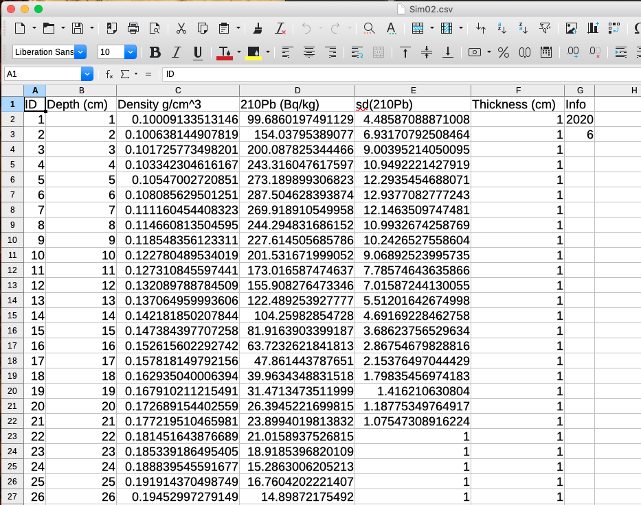{ width=50% }

In this case we used a core which only has $^{210}Pb$ measurements and we will have the last 6 data points to be used exclusively for supported 201Pb estimation (constant). If a proxy for supported $^{210}Pb$ is avalable the info column can be added as the 9th column (after the mesurement and standar deviation of the proxy for supported $^{210}Pb$).

Once this column has be added we can run Plum and in this case we will only be ask to confirme the number of sections
and shown our raw data.

```{r eval=FALSE}
Plum('Sim02')
```
```
 Run Sim02 with 25 sections? (Y/n) 
```
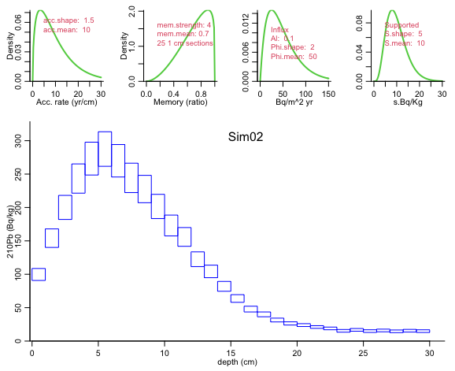{ width=50% }


After confirming we get the age-depth model.

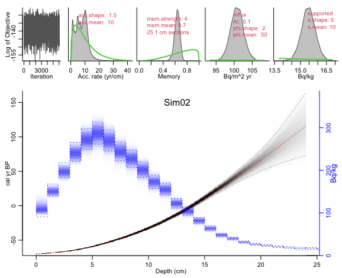{ width=50% }

# Adding other dates

Plum allows to incorporate other dating techniques such as Radiocarbon.


To run a core which has $^{210}Pb$ and $^{14}C$ (or other dates) you can add a extra file into the core folder. This new file can be call anything but we recomment to keep the convention of the `core_name-C.csv`. 

This new file should have the same format as those used in Bacon, i.e :

| labID | age | error | depth | cc| 
| --- | --- | --- | --- | ---| 
|SUERC-58273|	95	|35|	35|	1|
|SUERC-63932|	240	|37|	50|	1|


For this example we will used two radiocarbon dates taken from HP1C. 
you can find the data in the folder Plum_runs

To run this core with the extra radicoarbon dates we can use the following line:

```{r eval=FALSE}
Plum("HP1C",1,"HP1C_C")
```

In this case, we added the name of the core first, then the lenght of the sections and then the name of the file which contained the radiocarbon dates or calendar dates.

After confirming the number of sections, we get a merged age-depth model.
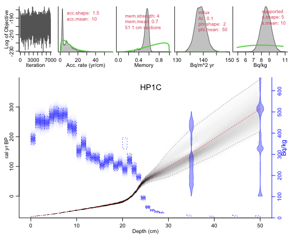{ width=50% }


